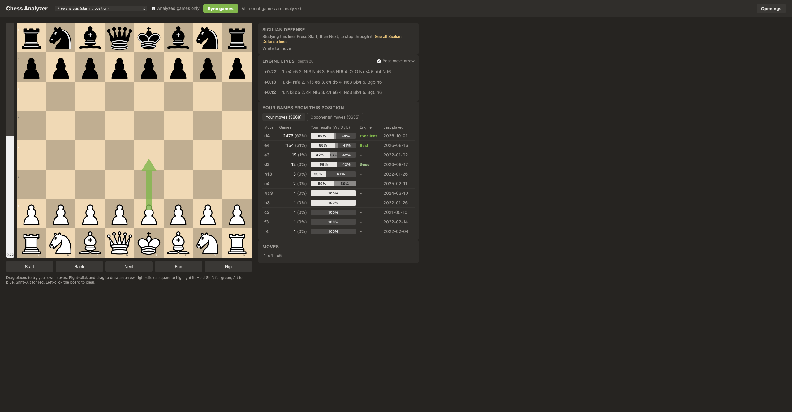

# Personal Chess Analyzer

I didn't want to pay for chess.com premium just to find out where my games went wrong, so I built my own analyzer.

It pulls my games from chess.com, stores every position in a local database and runs Stockfish over them. What I get back is a board I can actually think on: a game review, my own side lines, arrows, an opening explorer, and a record of what I've played in every position I've reached. It all runs on my laptop. The only thing it talks to online is chess.com's public API.

**[Try the live demo](https://tani7105.github.io/Personal_Chess_database_anaylser/)**. It has 40 of my recent games, and Stockfish runs right in your browser.



## What it does

- Imports my whole chess.com history (7,000+ games, about 490,000 positions) and picks up new games with a Sync button or an hourly background job.
- Reviews games the way chess.com does. Every move gets a label from Best to Blunder, and each player gets an accuracy score.
- Streams engine analysis while Stockfish searches. The first lines show up in about a tenth of a second and keep getting deeper.
- Lets me drag pieces at any point in a game to try something else. My lines branch off the game and show up in brackets in the move list.
- Draws arrows and highlights with a right-click, and shows the engine's best move as an arrow.
- Shows every move I've ever played in the current position, how I scored with it and what Stockfish thinks of it. Transpositions count, since it matches positions rather than move orders.
- Names the opening on every move and has an explorer for 3,815 named lines. Click "Catalan" and you get its variations as a tree, with my record in each one.

## How it works

```
chess.com API -> update.py -> SQLite -> analyze.py (Stockfish) -> server.py (Flask) -> browser
```

Some of the problems I ran into along the way:

- Raw centipawn loss made a bad blunder detector. Dropping from +7 to +5 got flagged even though I was still completely winning. Switching to lost win probability (the formula Lichess uses) cut the flagged blunders in my first 10 test games from 28 to 12. Those 12 all held up when I re-ran the analysis three times deeper.
- To match positions across games, I store each position without its move counters. The same position reached by a different move order still lines up.
- Batch analysis used to hold a database lock for the 15 to 30 seconds it spent on each game, so the Sync button kept failing with "database is locked". Now it analyzes the whole game first and saves it in one quick write, and the database runs in WAL mode so reads never wait.
- The live engine streams over server-sent events. When I move to a new position, the old search gets cancelled right away instead of finishing first.

## Built with

Python, Flask, SQLite, Stockfish, python-chess, Chessground (the board lichess uses), chess.js and the chess.com public API. Opening names come from [lichess-org/chess-openings](https://github.com/lichess-org/chess-openings).

## Running it yourself

You need Python 3.10+ and Stockfish (`brew install stockfish` on a Mac).

```
git clone https://github.com/Tani7105/Personal_Chess_database_anaylser.git
cd Personal_Chess_database_anaylser
python3 -m venv venv
source venv/bin/activate
pip install -r requirements.txt
```

Put your chess.com username in `USERNAME` at the top of `fetch.py` and `database.py`. Then:

```
python fetch.py          # download your full game history
python database.py       # load it into SQLite
python analyze.py 100 4  # analyze your 100 newest games on 4 CPU cores
python server.py         # open http://localhost:5050
```

After that, the Sync button (or `python update.py`) pulls in new games.

To rebuild the public demo, run `python export_demo.py`. It writes a static copy of the app into `docs/` with a sample of games, opponents' names replaced by "Opponent", and the browser build of Stockfish, which GitHub Pages serves as-is. To sync every hour on a Mac, fix the paths in `com.godlike7105.chessdb.plist`, copy it to `~/Library/LaunchAgents/` and load it with `launchctl bootstrap gui/$(id -u) <path to the plist>`.

## Files

| File | What it does |
| --- | --- |
| `server.py` | Web server: live engine, game review, position stats, opening explorer |
| `static/` | The board page, plus Chessground and chess.js in `static/vendor/` |
| `update.py` | Fetches recent games, imports new ones and analyzes them |
| `fetch.py`, `database.py` | Full history download and the database schema |
| `analyze.py` | Batch Stockfish analysis |
| `insights.py` | Game reviews, position history and opening stats, shared by the server and the demo |
| `export_demo.py`, `docs/` | Builds the public demo site, and the built site itself |
| `static/api.js`, `static/api-demo.js` | How the board gets its data: from the server, or from the demo's files plus in-browser Stockfish |
| `blunders.py` | Move scoring (win probability), also usable from the command line |
| `openings.py`, `openings/` | Opening names and the variation tree |
| `app.py` | My first viewer, built with Streamlit, before the current board |

## Credits

Stockfish (native, and the browser build from [stockfish.js](https://github.com/nmrugg/stockfish.js)) and Chessground are GPL-3.0, chess.js is BSD-2-Clause, and the lichess opening list is public domain (CC0). Their license files are in `static/vendor/` and `openings/`.
